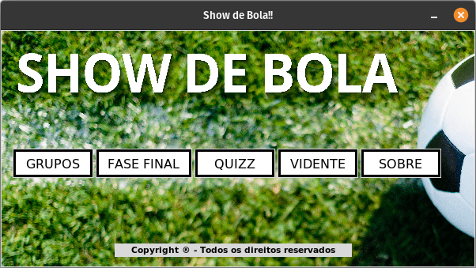

.. d documentation master file, created by
   sphinx-quickstart on Thu Jul 21 15:44:03 2022.
   You can adapt this file completely to your liking, but it should at least
   contain the root `toctree` directive.

Bem-vindo à documentação de Show de Bola!
==========================================

**Show de Bola** é um aplicativo codificado em python desenvolvido como projeto final da
disciplina Programação Orientada a Objetos, ofericida pelo curso de Bacharelado em Ciência da Computação
do Instituto de Mátematica em Ciência da Computação (ICMC) da Universidade de São Paulo (USP).

Desenvolvido pelos discentes:
    * Carlos Filipe de Castro Lemos
    * João Gabriel Sasseron Roberto Amorin
    * Pedro Guilherme dos Reis Teixeira
    * Pedro Henrique Vilela do Nascimento

Sob a tutela do docente:
    * Professor Márcio Delamaro

Nosso programa é baseado na copa do mundo de 2022 e planeja fazer uma emulação divertida para quem gosta do assunto.

.. note::
   As características do programa, tais como imagens, nomes e outros, foram utilizadas com propósitos 
   educacionais e acadêmicos sem qualquer intenção de obter fins lucrativos. Ressalte-se ainda que os 
   elementos do programa foram coletados na internet (em sites de conteúdos gratuitos e sem direitos autorais),
   sendo, por isso, desconhecidos os seus verdadeiros autores. Desse modo, caso haja interesse de receber os 
   devidos créditos, favor entrar em contato com integrantes do grupo para as devidas correções.

   
   Menu principal do Show de Bola.

.. toctree::
   :maxdepth: 2
   :caption: Conteúdos:

   modules

Índices e Tabelas
==================

* :ref:`genindex`
* :ref:`modindex`
* :ref:`search`

Módulos Utilizados
===================
	
* matplotlib
* os
* pandas
* PIL
* pygame
* random	
* tk
